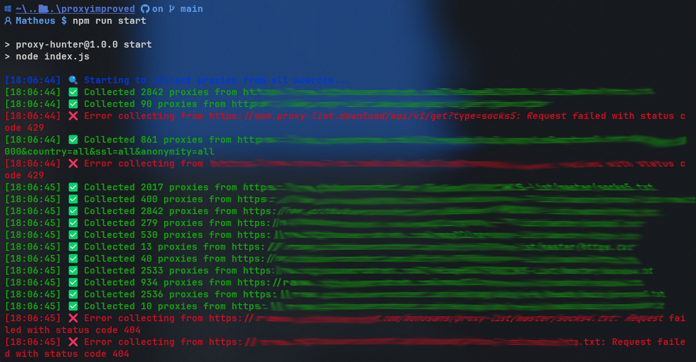

# 🌐 Proxy Validator

A robust and efficient proxy validator tool that collects, validates, and manages proxy lists from multiple sources. It features automated validation, Discord integration for reporting, detailed terminal feedback, and support for local proxy files.

## ✨ Features

- Multi-source proxy collection from various sources:
  - Online endpoints and APIs
  - Local TXT files (one proxy per line)
  - Configurable backup sources
- Intelligent proxy validation with multiple check endpoints
- Automated backup sources if primary sources fail
- Beautiful terminal interface with real-time progress tracking
- Discord webhook integration for validation reports
- Automatic proxy list saving with timestamps
- Configurable validation parameters
- Support for HTTP, HTTPS, SOCKS4, and SOCKS5 proxies

## 🚀 Installation

```bash
# Clone the repository
git clone https://github.com/imneli/proxy-validator

# Navigate to the project directory
cd proxy-validator

# Install dependencies
npm install
```

## 📋 Requirements

- Node.js 16.x or higher
- npm or yarn
- Discord webhook URL (optional, for reporting)

## 🛠️ Configuration

1. Create a `.env` file in the project root:
```env
DISCORD_WEBHOOK=your_webhook_url_here
```

2. (Optional) Modify proxy sources in `config.ts`:
```typescript
export const PROXY_SOURCES = [
    // Add your preferred proxy sources here
];
```

3. Set up local proxy files:
   - Create a `proxy-lists` folder in the project root
   - Add your .txt files with proxies (one proxy per line in IP:PORT format)
   - Files will be automatically read during validation

## 📁 Directory Structure

```
proxy-validator/
├── .env
├── proxy-lists/          # Your local proxy TXT files
│   ├── proxies1.txt
│   ├── proxies2.txt
│   └── ...
├── proxies/             # Output directory for valid proxies
└── ...
```

## 💻 Usage

```bash
# Run the script
npm run start
```

The validator will:
1. Read all .txt files from the `proxy-lists` directory
2. Collect proxies from configured online sources
3. Validate all unique proxies
4. Save valid proxies and generate reports

## 📝 Proxy File Format

Local proxy files should follow these guidelines:
- Text files with .txt extension
- One proxy per line
- Format: IP:PORT (e.g., 192.168.1.1:8080)
- Files can contain comments (lines without valid proxy format will be ignored)

Example proxy-lists/proxies.txt:
```
# HTTP Proxies
192.168.1.1:8080
10.0.0.1:3128

# SOCKS Proxies
172.16.0.1:1080
```

## 🚀 Interface



## 📊 Output

The validator generates two types of output:
1. A text file containing valid proxies in the `proxies` directory
2. A detailed Discord report (if webhook is configured) including:
   - Total proxies collected (from both files and URLs)
   - Number of valid proxies
   - Validation timestamp
   - Source statistics

## 📝 License

MIT License - feel free to use and modify for your needs.

## 🤝 Contributing

Contributions are welcome! Please feel free to submit a Pull Request.